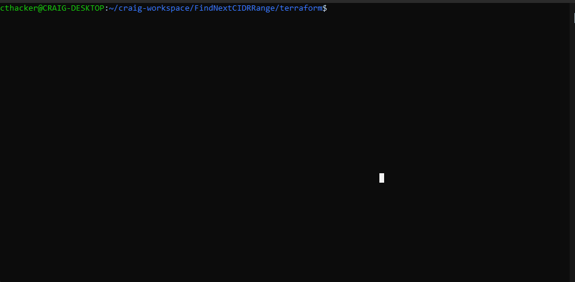
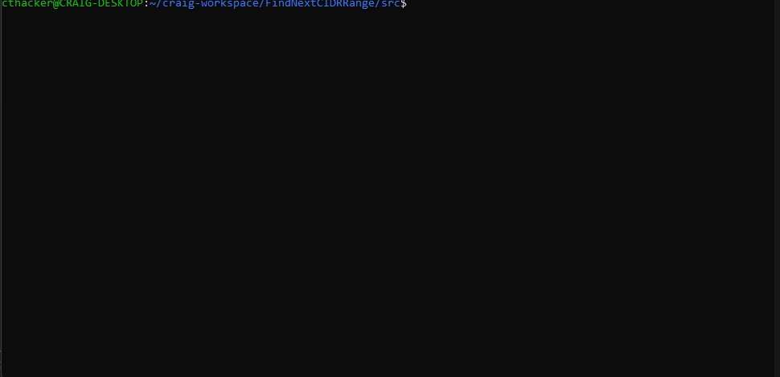

# Intro

**ANNOUNCEMENT**
This is Gary, the original author of this code. I am retiring from Microsoft in July of 2025, and will not longer 
be doing much in the way of Azure.

Craig Thacker, who added Terraform support a couple years ago, is taking over ownership. Thanks, Craig!

Hello :wave:

This repo hosts all the code and the mechanisms to deploy a Linux Azure Function App into to your tenant, with this function app acting as a method of getting the next CIDR range in a VNet.  Please check and the [original documentation and blog post](https://techcommunity.microsoft.com/t5/azure-networking-blog/programmatically-find-next-available-cidr-for-subnet/ba-p/3266016) for information on the original app. 

This repo:

- Hosts the code for the function app
- Give examples on how to build function apps needed resources using terraform
- Give examples on how to deploy the function via Azure Function Core tools

The function itself is an HTTP function, which, will only run on request. Please note, the function app does require reader permissions over the virtual network.

**Worth a note, that this won't work out the box for you, you are expected to use your own intuition or reach out for help, we will keep mentioning this as the documentation goes on :smile:**

There is just one function:
- `GetCidr` 

You can query the API by feeding it the parameters in the following format via an HTTP GET request:

`https://{{pathToFunctionApp}}?subscriptionId={{subscriptionId}}&resourceGroupName={{resourceGroupName}}&virtualNetworkName={{virtualNetworkName}}&cidr={{cidr}}&addressSpace={{addressSpace}}`

The 'addressSpace' parameter is optional. If not specified, the code will return the first valid subnet it finds. All other parameters are mandatory.

So, for example:

`https://fnc-ldo-euw-dev-01.azurewebsites.net/api/getcidr?subscriptionId=09d383ee-8ed0-4374-ad9f-3344cabc323b&resourceGroupName=rg-ldo-euw-dev-build&virtualNetworkName=vnet-ldo-euw-dev-01&cidr=26&addressSpace=10.30.0.0/16`

With example output:

```json
{
  "name": "vnet-ldo-euw-dev-01",
  "id": "/subscriptions/09d383ee-8ed0-4374-ad9f-3344cabc323b/resourceGroups/rg-ldo-euw-dev-build/providers/Microsoft.Network/virtualNetworks/vnet-ldo-euw-dev-01",
  "type": "Microsoft.Network/virtualNetworks",
  "location": "westeurope",
  "addressSpace": "10.0.0.0/16",
  "proposedCIDR": "10.0.0.0/26"
}
```

_Please note, my function app will be taken down by Terraform regularly, chances are if you try to test query it, it will fail_

## Building the environment

At the time of writing, this project only supports local deployments and is set up to find some expected items in the Azure tenant.  Please check the fork from [Libre DevOps](https://github.com/libre-devops/azure-cidr-checker-function-app) to see a automated build using continious integration from GitHub Actions :rocket:

You can freely use the modules used to deploy these resources to suit your needs, but setting up the bits regarding security, segregation, etc. will be up to you.

## Terraform Build

### Disclaimer

This solutions is _not_ turnkey and won't take into considerations the perimeter network and identity policies you will have in your tenant.

The automation is provided _as-is_ for a quick setup and is not intended for production deployments. Please be sure to conduct due diligence when using this automation.

The terraform build will deploy:
- 1x Resource Group
- 1x Linux Function app on Consumption Service Plan with Dotnet 6.0 Application Stack (up to date with the v3 Azurerm provider changes in terraform)
- 1x Storage Account, Hot access tier, for the storage of the function apps file system

### How to use

To use the terraform build, you will need to ***already have*** a virtual network inside a resource group, as well as knowing the name of the resource group and virtual network respectively, as these will be fed to the script.

You will also need ***IAM permissions*** to read and assign permissions to this resource (e.g Owner or Reader + User Access Administrator, again, please consult with the security policies in your tenant regarding IAM and identity) 

**Finally**, simply edit the `run-terraform.sh` (for example) inside the `terraform` folder in this repo

The script is setup with the variables placed at the top of the script, which will then be passed to terraform.  The shell script **requires** the `azure-cli`, `curl`, and `jq` to work. It will check if they are installed and error if not :cross:  

Again, you will need various IAM access to run this terraform under your account used with the `az login` prompt, but you are free to adapt it to run under a service principal or managed identity should you wish :smile:

An example is something like so:

```shell
#!/usr/bin/env bash

set -eou pipefail

vnet_rg_name="rg-ldo-euw-dev-build" # The resource group name where your _existing_ VNet is.
vnet_name="rg-ldo-euw-dev-build"    # The name of your existing virtual network.

rg_name="cidr-app"             # The name of the resource group which terraform will create and add the function app to
resource_location="westeurope" # The name of the Azure region all terraform (function app etc) resources will be created with
```




## Deploying the Function

The deployment of the function can be done many ways, and again, this is not a turn-key solution, but an easy way to deploy is to make sure you have the stack (e.g. Python, Dotnet) installed, and install the `azure-functions-core-tools-4`.  More info on this can be found on the [Microsoft Documentation](https://docs.microsoft.com/en-us/azure/azure-functions/functions-run-local?tabs=v4%2Cmacos%2Ccsharp%2Cportal%2Cbash)

After installing the stack and the tools, and assuming you have permission to write to the function app on your Azure account, you can run a script like the `deploy-function.sh` script inside the `src` folder

```shell
#!/usr/bin/env bash

function_app_name="example"
code_directory="Find-NextCidrRange"
additional_stack_params="--csharp --force"
```
This script will check you have logged in and the tools installed and attempt a deploy, it will **not** check for your language stack.


It will then give an output like so, assuming you have the `dotnet-sdk-6.0` and the `azure-functions-core-tools-4` packages installed:



However, this is just 1 of may ways to deploy this :wink:, so feel free to adapt or contribute to improve!
